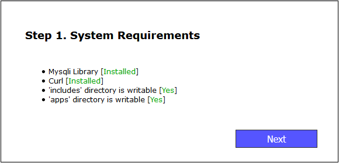
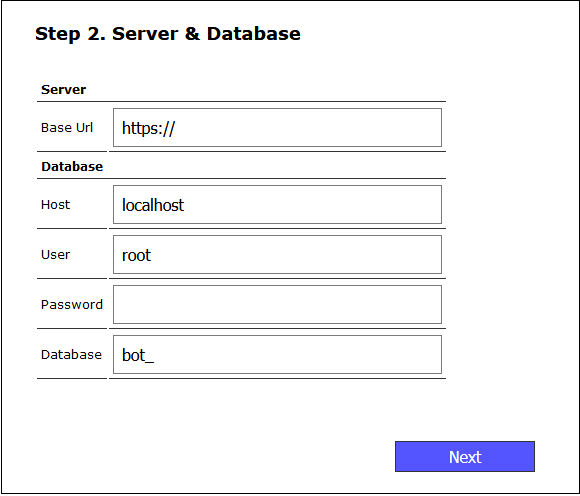
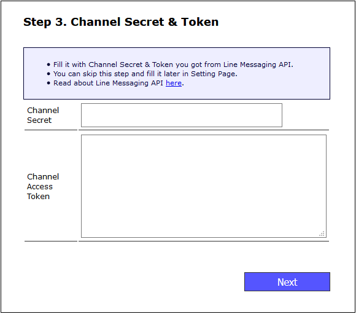
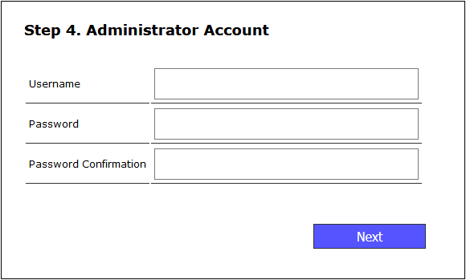
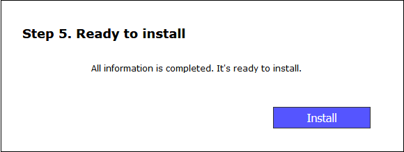
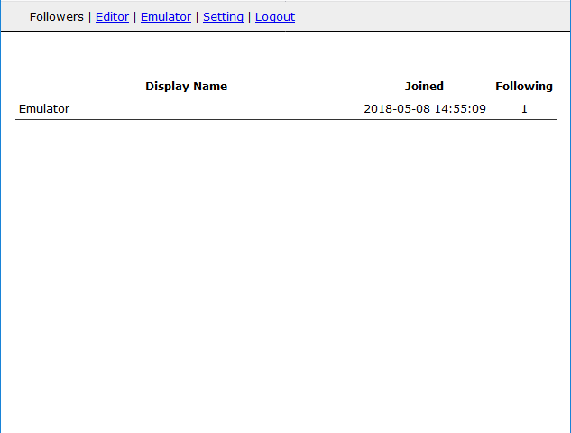
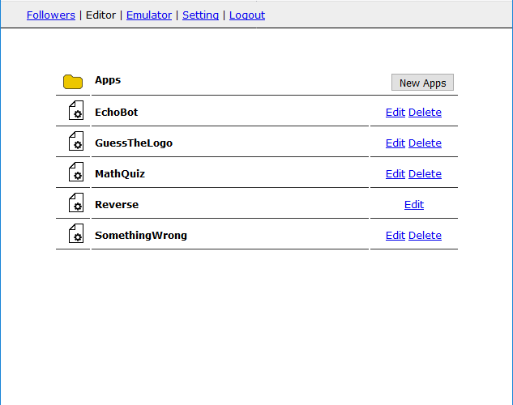
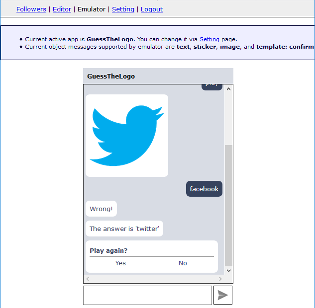
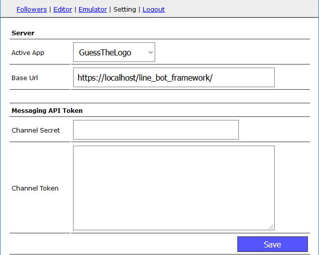

# LINE Bot Framework
Framework to create bot for LINE Messenger

# Release notes
v. 0.7.2
- Bug fixed issue #2 
- Add $image_url on GuestTheLogo.php for clearer configuration 

v. 0.7.1
- update on_message now receive all message body, not only text 

Features:
- Installation Wizard
- Code Editor
- Emulator
- Modular Apps


# Pre-requisite
- Web Server with PHP + mysqli + curl
- MySQL Server

# Getting Started
Download these project files and put it in your web server folder.
Open web page with your web browser. It will display installation wizard.

# Installation Wizard
 

 
 
 
 
 
 
 
 
 
# Pages
- Adders list

 
 
- Editor with sample apps

 
 
- Emulator

 
 
- Settings

 
 
 
 
# Sample Apps
- EchoBot
```
<?php
	class EchoBot extends Line_Apps{
				
		function on_follow(){
			return "Hi!";
		}
		
		function on_message($text){
			return "Echo: " . $text;
		}
	}
```

- Reverse
```
<?php
	class Reverse extends Line_Apps{
				
		function on_follow(){
			return "Welcome {$this->profile->display_name}.\nThis bot will respond with reversed words.";
		}
		
		function on_message($text){
			return strrev($text);
		}
	}
```

You can see other apps on Editor page